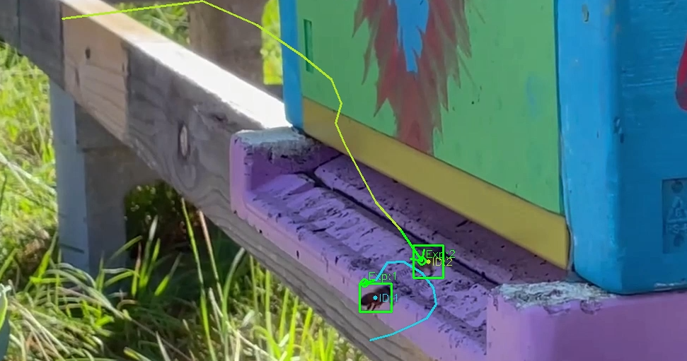
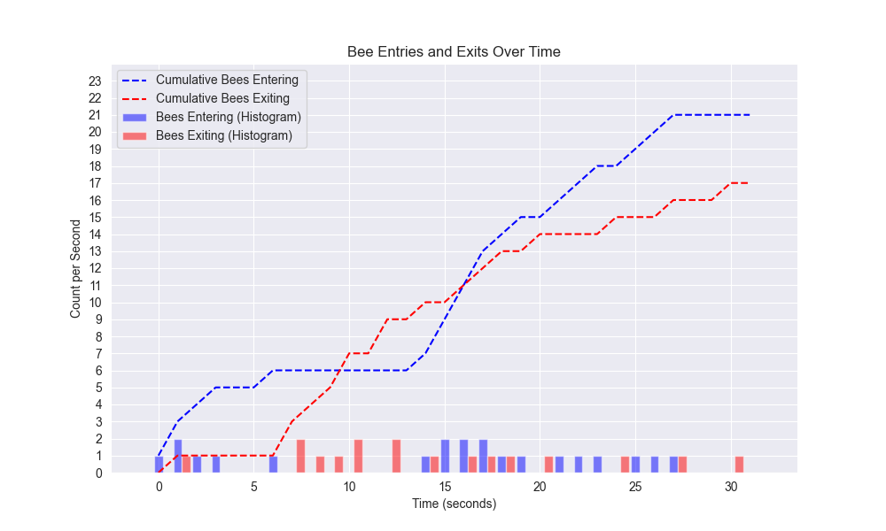
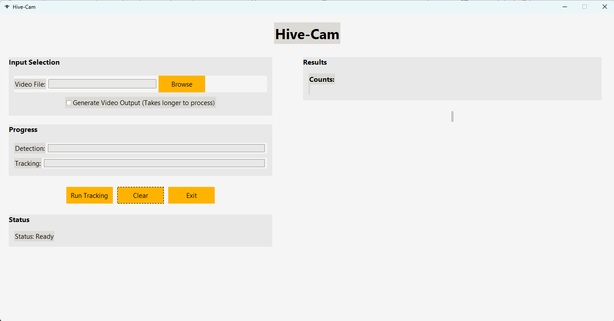
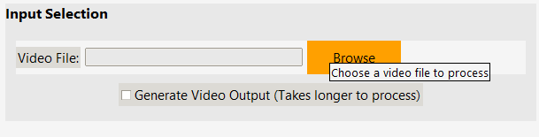
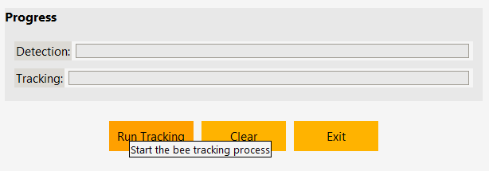
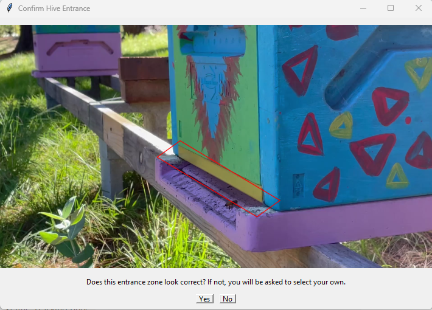
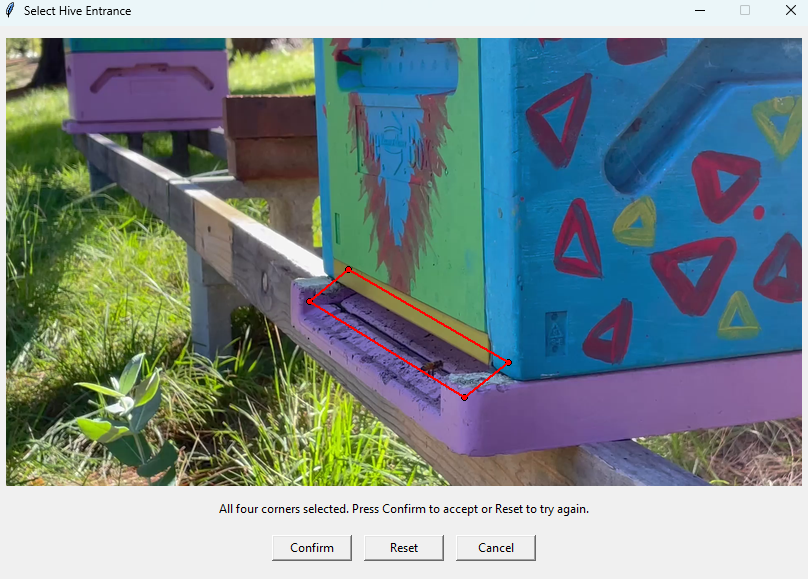
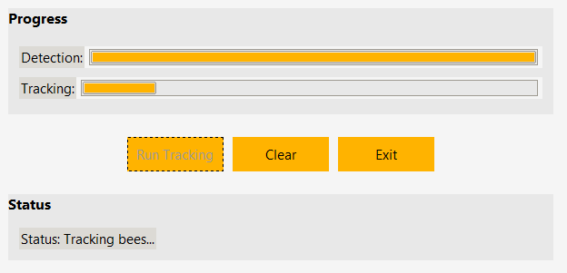
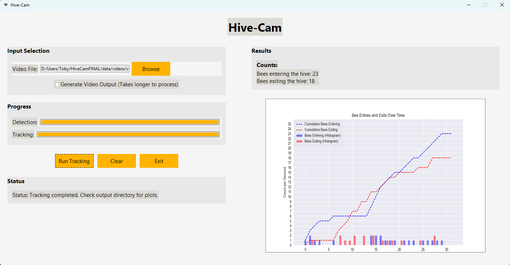

  <h1 align="center">🎥 🐝 Hive-Cam 🐝🐝</h1>

  <p align="center">
    This is Hive-Cam! A lightweight computer vision model for honeybee tracking and counting.
    Like a doorbell camera for your beehive, this model keeps track of how many bees are entering and exiting the hive entrance over time.
    <br />
  </p>
</p>



---

# On This Page:
1. [About the Project](#-about-the-project)
2. [Built With](#%EF%B8%8F-built-with)
3. [How to use](#-how-to-use)
4. [Roadmap](#%EF%B8%8F-roadmap)
5. [Benchmarking and Performance](#-benchmarking-and-performance)

---

# 🐝 About the Project
Check out the project report: (Coming Soon!)

This project seeks to develop and deploy a computer vision model that can be used by the general public to gather information about bee foraging activity in a variety of places, seasons, and contexts.
The way Hive-Cam works is:

👉 Upload a video of your hive entrance

👉 Hive-Cam will automatically identify, track, and count the bees as they fly in and out

👉 See trends in bee foraging activity over time:



---

# 🛠️ Built With

- [YOLOv8](https://yolov8.com/)
- [Python](https://www.python.org/)
- [Grok](https://grok.com/)
- [ChatGPT](https://chatgpt.com/)

---

# 💻 How to Use

## 📑 If you just want to use the App (recommended):
To get started, you can download just the app and its files from this page to your computer. 

Click [HERE](https://download-directory.github.io/?url=https://github.com/TobysWorkshop/Hive-Cam/tree/main/app) to download just the app folder from this page. This will open a new window where the app files will be processed into a .zip file and downloaded to your computer.

You will then need to unzip the folder (on Windows: locate it in your downloads folder, right-click the .zip file, and select "Extract All...").

Once the files have finished extracting, you can open the newly saved folder. It should contain two folders called "_internal" and "output", and a "HiveCam.exe" file.

Double-click/open the HiveCam.exe file. After a short delay, the app should start and you'll see the interface pop up on the screen.

Now you can check out [how to use the App interface](#-how-to-use-the-app-interface)!


## 🗃 If you want to access/run the source files:
If you want to access and run the source files, there are two ways you can download them:

### 1. Use git clone.

Make sure you have **[Git](https://git-scm.com/downloads)** installed.

Find a file location where you want the files to be saved, and open a terminal there (on Windows: right-click -> 'Open in Terminal').

Then run the following code:

```bash
git clone https://github.com/TobysWorkshop/Hive-Cam.git
```

The repository should now be cloned and ready to use.

### 2. Download the raw files from this page.

At the top of this page, find the green button that says "< > Code". Click that and then select "Download ZIP". This will compress the raw files to a ZIP file and save it to your downloads folder. You will need to extract the files before you can use them (Windows: right-click -> "Extract All...").

## 🤝 How to use the App interface
When you open the app, you should get greeted with an interface like this:



The app is broken up into a video input selection at the top, a progress tracker and a status indicator on the left, and a results display on the right.

To start, select the yellow "Browse" button next to the input section. A separate window will pop up, prompting you to choose a video file to upload into the model. Navigate to where your desired video file is located and confirm your selection.



Once you've selected a video file, you may optionally select the "Generate Video Output" option. This is not usually recommended, as it considerably slows down the process. But ticking this will plot the tracks and bee detections over the top of the video and save it to the app's output folder (app/output).

Then, press the yellow "Run Track" button on the left of the progress section. This will begin to run the model on the input video.



The model will attempt to automatically select an appropriate box that fits over the hive entrance in the video. A pop-up window will appear asking you to double-check its estimate and confirm whether or not it looks correct. If you select "Yes", the model will proceed with this entrance box. If you select "No", then a new window will open prompting you to select your own entrance box on the image.



If you decide to select your own entrance box, select the four points of your desired box by clicking on the image where you want them to be. Make sure you select them in a circular order (e.g. top left, top right, bottom right, bottom left). If you're happy, click "Confirm" to use this as the entrance box. If you'd like to start again, click "Reset".



The entrance box should include the entire entrance way, with some overhang on all sides - especially on the right and left sides and above the entrance. For the best counting performance, try to leave some space at the bottom of the entrance ramp that the box does not cover. See the image above for a good example of a well-defined entrance box.

Once an entrance box has been defined, the model will start processing, and the two progress bars will begin to run one after another. The first, labelled "Detection", shows the progress as the model identifies bees and hive entrance regions in each individual video frame. The second, labelled "Tracking", shows the progress as the model then tracks those bees across the video frames. During this, you will see the status update in the "Status" box underneath.



Once the model has finished processing, the results will be displayed on the right-hand side. The total count of bees entering and exiting will be displayed at the top of the results, and the plotted histogram of counts over time will be displayed underneath.



The histogram is also saved as an image file in the app's output folder (app/output).

You can then click the "Clear" button to remove all selections and results to start again.
Click the "Exit" button or the 'x' in the top right corner of the window to close the app.

---

# 🗺️ Roadmap
For initial release:
- [x] Get YOLO-based bee detection off the ground
- [x] Work out how to track bees across video frames effectively
- [x] Develop a simple GUI and compile to a usable app
- [x] Publish the GitHub repo
- [ ] Write up project report for reference

🥳🥳🥳

For future development:
- [ ] Test performance on a variety of contexts and hive-types
- [ ] Add functionality to track different classes of honeybees (add 'pollen bee' and 'drone')
- [ ] Attempt to optimise speed, particularly for longer video file integration
- [ ] Build a more professional and comprehensive app interface

---

# 📈 Benchmarking and Performance

So far, we have measured performance using a limited test set of two 30-second videos. The ground truth and model results are shown below for these two cases.

| Test Video | Model count ENTERING | Model count EXITING | Ground truth ENTERING | Ground truth EXITING |
|-----------|-----------|-----------|-----------|-----------|
| Video B | 23 | 18 | 24 | 19 |
| Video A | 4 | 11 | 3 | 14 |

---
